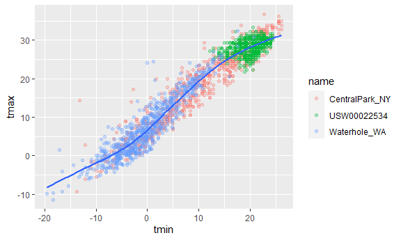
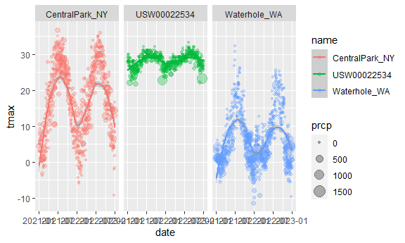
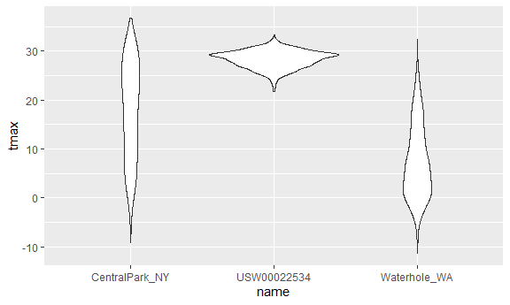

Visualization with ggplot 1
================
Lucia Wang
2023-09-28

(knitr will do your settings for figures)

``` r
library(tidyverse)
```

    ## ── Attaching core tidyverse packages ──────────────────────── tidyverse 2.0.0 ──
    ## ✔ dplyr     1.1.3     ✔ readr     2.1.4
    ## ✔ forcats   1.0.0     ✔ stringr   1.5.0
    ## ✔ ggplot2   3.4.3     ✔ tibble    3.2.1
    ## ✔ lubridate 1.9.2     ✔ tidyr     1.3.0
    ## ✔ purrr     1.0.2     
    ## ── Conflicts ────────────────────────────────────────── tidyverse_conflicts() ──
    ## ✖ dplyr::filter() masks stats::filter()
    ## ✖ dplyr::lag()    masks stats::lag()
    ## ℹ Use the conflicted package (<http://conflicted.r-lib.org/>) to force all conflicts to become errors

``` r
library(ggridges)

knitr::opts_chunk$set(
  fig.width = 6,
  fig.asp = .6,
  out.width = "90%"
)
```

## Using NOAA weather data from the internet

``` r
weather_df = 
  rnoaa::meteo_pull_monitors(
    c("USW00094728", "USW00022534", "USS0023B17S"),
    var = c("PRCP", "TMIN", "TMAX"), 
    date_min = "2021-01-01",
    date_max = "2022-12-31") |>
  mutate(
    name = recode(
      id, 
      USW00094728 = "CentralPark_NY", 
      USC00519397 = "Molokai_HI",
      USS0023B17S = "Waterhole_WA"),
    tmin = tmin / 10,
    tmax = tmax / 10) |>
  select(name, id, everything())
```

    ## using cached file: C:\Users\wangl\AppData\Local/R/cache/R/rnoaa/noaa_ghcnd/USW00094728.dly

    ## date created (size, mb): 2023-09-28 10:19:41.358543 (8.541)

    ## file min/max dates: 1869-01-01 / 2023-09-30

    ## using cached file: C:\Users\wangl\AppData\Local/R/cache/R/rnoaa/noaa_ghcnd/USW00022534.dly

    ## date created (size, mb): 2023-09-28 10:20:24.763447 (3.838)

    ## file min/max dates: 1949-10-01 / 2023-09-30

    ## using cached file: C:\Users\wangl\AppData\Local/R/cache/R/rnoaa/noaa_ghcnd/USS0023B17S.dly

    ## date created (size, mb): 2023-09-28 10:20:36.160564 (0.996)

    ## file min/max dates: 1999-09-01 / 2023-09-30

``` r
weather_df
```

    ## # A tibble: 2,190 × 6
    ##    name           id          date        prcp  tmax  tmin
    ##    <chr>          <chr>       <date>     <dbl> <dbl> <dbl>
    ##  1 CentralPark_NY USW00094728 2021-01-01   157   4.4   0.6
    ##  2 CentralPark_NY USW00094728 2021-01-02    13  10.6   2.2
    ##  3 CentralPark_NY USW00094728 2021-01-03    56   3.3   1.1
    ##  4 CentralPark_NY USW00094728 2021-01-04     5   6.1   1.7
    ##  5 CentralPark_NY USW00094728 2021-01-05     0   5.6   2.2
    ##  6 CentralPark_NY USW00094728 2021-01-06     0   5     1.1
    ##  7 CentralPark_NY USW00094728 2021-01-07     0   5    -1  
    ##  8 CentralPark_NY USW00094728 2021-01-08     0   2.8  -2.7
    ##  9 CentralPark_NY USW00094728 2021-01-09     0   2.8  -4.3
    ## 10 CentralPark_NY USW00094728 2021-01-10     0   5    -1.6
    ## # ℹ 2,180 more rows

## Basic scatterplot

first put in dataset, then the aesthetic mappings, then the geometries

``` r
ggplot(weather_df, aes(x=tmin, y=tmax)) +
  geom_point()
```

    ## Warning: Removed 17 rows containing missing values (`geom_point()`).


`geom_point()` puts a dot for each datapoint (scatterplot)

you can also use pipe to make the graphs. same graph - but helpful if
you want to add more functions like filter, select, mutate, other data
manip steps etc

``` r
weather_df |>
  ggplot(aes(x=tmin, y=tmax)) +
  geom_point()
```

    ## Warning: Removed 17 rows containing missing values (`geom_point()`).


if you want to save an object/print it, name the plot

``` r
ggp_weather = 
  weather_df |>
  ggplot(aes(x = tmin, y = tmax)) 

ggp_weather + geom_point()
```

    ## Warning: Removed 17 rows containing missing values (`geom_point()`).


\## advanced plots

add color to names and smooth lines thru each group.

where you define the aesthetic matters because if you put `color=` in a
different place it puts that there instead.

`alpha` = opacity

``` r
ggplot(weather_df, aes(x = tmin, y = tmax)) + 
  geom_point(aes(color = name), alpha=.3) +
  geom_smooth(se=FALSE)
```

    ## `geom_smooth()` using method = 'gam' and formula = 'y ~ s(x, bs = "cs")'

    ## Warning: Removed 17 rows containing non-finite values (`stat_smooth()`).

    ## Warning: Removed 17 rows containing missing values (`geom_point()`).



now add facets (panels). `.` substitutes for col, then put `~` then row
vars

``` r
weather_df |>
  ggplot(aes(x=tmin, y=tmax, color=name)) +
  geom_point(alpha=.3) +
  geom_smooth(se=FALSE) +
  facet_grid(. ~ name)
```

    ## `geom_smooth()` using method = 'loess' and formula = 'y ~ x'

    ## Warning: Removed 17 rows containing non-finite values (`stat_smooth()`).

    ## Warning: Removed 17 rows containing missing values (`geom_point()`).


lets try a different plot. using precipitation as the size of points

``` r
weather_df |>
  ggplot(aes(x=date, y=tmax, color=name)) +
  geom_point(aes(size= prcp),alpha=.3) +
  geom_smooth() +
  facet_grid(. ~ name)
```

    ## `geom_smooth()` using method = 'loess' and formula = 'y ~ x'

    ## Warning: Removed 17 rows containing non-finite values (`stat_smooth()`).

    ## Warning: Removed 19 rows containing missing values (`geom_point()`).



if assigning a specific color… careful where you put it in the aes

some fun options - `geom_hex()` for density

``` r
ggplot(weather_df, aes(x = tmax, y = tmin)) + 
  geom_hex()
```

    ## Warning: Removed 17 rows containing non-finite values (`stat_binhex()`).


line plot (connects the dots)

``` r
weather_df |>
  filter(name == "USW00022534") |>
  ggplot(aes(x=date, y=tmax)) +
  geom_line() 
```


## univariate

same thought process: dataframe, which var maps onto what, what
geometry. lets make a histogram… (use `dodge=` to put the groups
separate on the same plot - but maybe not best)

``` r
ggplot(weather_df, aes(x=tmax)) +
  geom_histogram()
```

    ## `stat_bin()` using `bins = 30`. Pick better value with `binwidth`.

    ## Warning: Removed 17 rows containing non-finite values (`stat_bin()`).


or a density plot.. `adjust=` is to smooth ?

``` r
ggplot(weather_df, aes(x=tmax, fill=name)) +
  geom_density(alpha=0.3, adjust=.75)
```

    ## Warning: Removed 17 rows containing non-finite values (`stat_density()`).


boxplots

``` r
ggplot(weather_df, aes(x=name, y=tmax)) +
  geom_boxplot()
```

    ## Warning: Removed 17 rows containing non-finite values (`stat_boxplot()`).


violin plots (density plot + vertical + mirrored)

``` r
ggplot(weather_df, aes(x=name, y=tmax)) +
  geom_violin()
```

    ## Warning: Removed 17 rows containing non-finite values (`stat_ydensity()`).



ridge plot (like violin + density? helpful if lots of categories and
shape of distribution matters)

``` r
ggplot(weather_df, aes(x=tmax, y=name)) +
  geom_density_ridges(scale=.85)
```

    ## Picking joint bandwidth of 1.54

    ## Warning: Removed 17 rows containing non-finite values
    ## (`stat_density_ridges()`).


## save a plot

make a folder in your directory then use `ggsave()`

``` r
ggweather = 
  ggplot(weather_df, aes(x=tmax, y=name)) +
  geom_density_ridges(scale=.85)

ggsave("results/ggweather.pdf", ggweather)
```

    ## Saving 6 x 3.59 in image
    ## Picking joint bandwidth of 1.54

    ## Warning: Removed 17 rows containing non-finite values
    ## (`stat_density_ridges()`).
