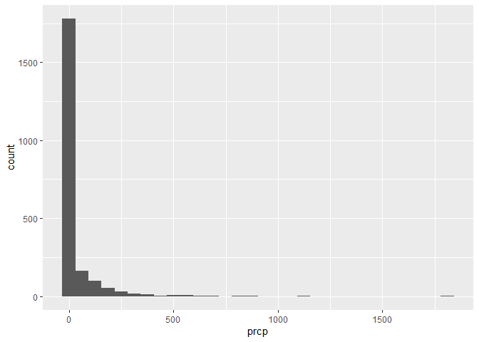
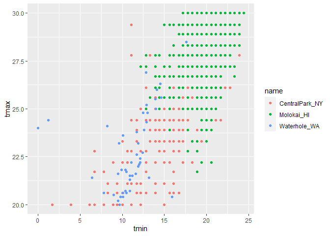
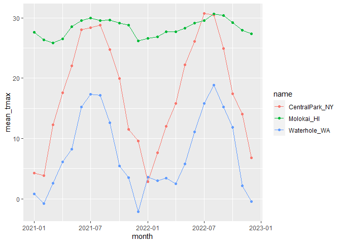

Viz 3/EDA
================
Lucia Wang (lw3061)
2023-10-05

``` r
library(tidyverse)
```

    ## ── Attaching core tidyverse packages ──────────────────────── tidyverse 2.0.0 ──
    ## ✔ dplyr     1.1.3     ✔ readr     2.1.4
    ## ✔ forcats   1.0.0     ✔ stringr   1.5.0
    ## ✔ ggplot2   3.4.3     ✔ tibble    3.2.1
    ## ✔ lubridate 1.9.2     ✔ tidyr     1.3.0
    ## ✔ purrr     1.0.2     
    ## ── Conflicts ────────────────────────────────────────── tidyverse_conflicts() ──
    ## ✖ dplyr::filter() masks stats::filter()
    ## ✖ dplyr::lag()    masks stats::lag()
    ## ℹ Use the conflicted package (<http://conflicted.r-lib.org/>) to force all conflicts to become errors

import data as before, add month variable

``` r
weather_df = 
  rnoaa::meteo_pull_monitors(
    c("USW00094728", "USW00022534", "USS0023B17S"),
    var = c("PRCP", "TMIN", "TMAX"), 
    date_min = "2021-01-01",
    date_max = "2022-12-31") |>
  mutate(
    name = recode(
      id, 
      USW00094728 = "CentralPark_NY", 
      USW00022534 = "Molokai_HI",
      USS0023B17S = "Waterhole_WA"),
    tmin = tmin / 10,
    tmax = tmax / 10,
    month = lubridate::floor_date(date, unit = "month")) |>
  select(name, id, everything())
```

    ## using cached file: C:\Users\wangl\AppData\Local/R/cache/R/rnoaa/noaa_ghcnd/USW00094728.dly

    ## date created (size, mb): 2023-09-28 10:19:41.358543 (8.541)

    ## file min/max dates: 1869-01-01 / 2023-09-30

    ## using cached file: C:\Users\wangl\AppData\Local/R/cache/R/rnoaa/noaa_ghcnd/USW00022534.dly

    ## date created (size, mb): 2023-09-28 10:20:24.763447 (3.838)

    ## file min/max dates: 1949-10-01 / 2023-09-30

    ## using cached file: C:\Users\wangl\AppData\Local/R/cache/R/rnoaa/noaa_ghcnd/USS0023B17S.dly

    ## date created (size, mb): 2023-09-28 10:20:36.160564 (0.996)

    ## file min/max dates: 1999-09-01 / 2023-09-30

## initial numeric work

``` r
weather_df |>
  ggplot(aes(x=prcp)) +
  geom_histogram()
```

    ## `stat_bin()` using `bins = 30`. Pick better value with `binwidth`.

    ## Warning: Removed 15 rows containing non-finite values (`stat_bin()`).

<!-- --> pretty skewed
distribution, but some really big outliers.

``` r
weather_df |>
  filter(prcp > 1000)
```

    ## # A tibble: 3 × 7
    ##   name           id          date        prcp  tmax  tmin month     
    ##   <chr>          <chr>       <date>     <dbl> <dbl> <dbl> <date>    
    ## 1 CentralPark_NY USW00094728 2021-08-21  1130  27.8  22.8 2021-08-01
    ## 2 CentralPark_NY USW00094728 2021-09-01  1811  25.6  17.2 2021-09-01
    ## 3 Molokai_HI     USW00022534 2022-12-18  1120  23.3  18.9 2022-12-01

3 obs bigger than 1000.

``` r
weather_df |>
  filter(tmax >= 20, tmax <= 30) |>
  ggplot(aes(x=tmin, y=tmax, color=name)) +
  geom_point()
```

<!-- --> banded
structure - why? recorded in F, converted to C, rounded? Waterhole is
recording it differently which is why its distribution looks different

## grouping

``` r
weather_df |>
  group_by(name, month)
```

    ## # A tibble: 2,190 × 7
    ## # Groups:   name, month [72]
    ##    name           id          date        prcp  tmax  tmin month     
    ##    <chr>          <chr>       <date>     <dbl> <dbl> <dbl> <date>    
    ##  1 CentralPark_NY USW00094728 2021-01-01   157   4.4   0.6 2021-01-01
    ##  2 CentralPark_NY USW00094728 2021-01-02    13  10.6   2.2 2021-01-01
    ##  3 CentralPark_NY USW00094728 2021-01-03    56   3.3   1.1 2021-01-01
    ##  4 CentralPark_NY USW00094728 2021-01-04     5   6.1   1.7 2021-01-01
    ##  5 CentralPark_NY USW00094728 2021-01-05     0   5.6   2.2 2021-01-01
    ##  6 CentralPark_NY USW00094728 2021-01-06     0   5     1.1 2021-01-01
    ##  7 CentralPark_NY USW00094728 2021-01-07     0   5    -1   2021-01-01
    ##  8 CentralPark_NY USW00094728 2021-01-08     0   2.8  -2.7 2021-01-01
    ##  9 CentralPark_NY USW00094728 2021-01-09     0   2.8  -4.3 2021-01-01
    ## 10 CentralPark_NY USW00094728 2021-01-10     0   5    -1.6 2021-01-01
    ## # ℹ 2,180 more rows

seems invisible (doesn’t add columns), but shows that its grouped/how
many groups there are in the message. (like sorting). it looks the same,
but the df knows its grouped

## counting

``` r
weather_df |>
  group_by(name, month) |>
  summarize(n_obs = n())
```

    ## `summarise()` has grouped output by 'name'. You can override using the
    ## `.groups` argument.

    ## # A tibble: 72 × 3
    ## # Groups:   name [3]
    ##    name           month      n_obs
    ##    <chr>          <date>     <int>
    ##  1 CentralPark_NY 2021-01-01    31
    ##  2 CentralPark_NY 2021-02-01    28
    ##  3 CentralPark_NY 2021-03-01    31
    ##  4 CentralPark_NY 2021-04-01    30
    ##  5 CentralPark_NY 2021-05-01    31
    ##  6 CentralPark_NY 2021-06-01    30
    ##  7 CentralPark_NY 2021-07-01    31
    ##  8 CentralPark_NY 2021-08-01    31
    ##  9 CentralPark_NY 2021-09-01    30
    ## 10 CentralPark_NY 2021-10-01    31
    ## # ℹ 62 more rows

`summarize()` works over each group - makes new df with only groups and
vars you want

``` r
weather_df |> 
  count(name, month)
```

    ## # A tibble: 72 × 3
    ##    name           month          n
    ##    <chr>          <date>     <int>
    ##  1 CentralPark_NY 2021-01-01    31
    ##  2 CentralPark_NY 2021-02-01    28
    ##  3 CentralPark_NY 2021-03-01    31
    ##  4 CentralPark_NY 2021-04-01    30
    ##  5 CentralPark_NY 2021-05-01    31
    ##  6 CentralPark_NY 2021-06-01    30
    ##  7 CentralPark_NY 2021-07-01    31
    ##  8 CentralPark_NY 2021-08-01    31
    ##  9 CentralPark_NY 2021-09-01    30
    ## 10 CentralPark_NY 2021-10-01    31
    ## # ℹ 62 more rows

not a readable df but does similar to summarize with n

``` r
weather_df |>
  count(name, month) |>
  pivot_wider(
    names_from = name,
    values_from = n
  )
```

    ## # A tibble: 24 × 4
    ##    month      CentralPark_NY Molokai_HI Waterhole_WA
    ##    <date>              <int>      <int>        <int>
    ##  1 2021-01-01             31         31           31
    ##  2 2021-02-01             28         28           28
    ##  3 2021-03-01             31         31           31
    ##  4 2021-04-01             30         30           30
    ##  5 2021-05-01             31         31           31
    ##  6 2021-06-01             30         30           30
    ##  7 2021-07-01             31         31           31
    ##  8 2021-08-01             31         31           31
    ##  9 2021-09-01             30         30           30
    ## 10 2021-10-01             31         31           31
    ## # ℹ 14 more rows

a bit more readable! had to purposely “un”tidy it

## general summaries

``` r
weather_df |>
  group_by(name) |>
  summarize(
    mean_tmax = mean(tmax)
  )
```

    ## # A tibble: 3 × 2
    ##   name           mean_tmax
    ##   <chr>              <dbl>
    ## 1 CentralPark_NY      17.7
    ## 2 Molokai_HI          NA  
    ## 3 Waterhole_WA        NA

missing values! can solve with `drop_na(tmax)`, or within the actual
function with `na.rm=`

``` r
weather_df |>
  group_by(name, month) |>
  summarize(
    mean_tmax = mean(tmax, na.rm=TRUE),
    median_tmax = median(tmax, na.rm=TRUE),
    sd_tmax = sd(tmax, na.rm=TRUE)
  )
```

    ## `summarise()` has grouped output by 'name'. You can override using the
    ## `.groups` argument.

    ## # A tibble: 72 × 5
    ## # Groups:   name [3]
    ##    name           month      mean_tmax median_tmax sd_tmax
    ##    <chr>          <date>         <dbl>       <dbl>   <dbl>
    ##  1 CentralPark_NY 2021-01-01      4.27         5      3.34
    ##  2 CentralPark_NY 2021-02-01      3.87         2.8    3.99
    ##  3 CentralPark_NY 2021-03-01     12.3         12.2    6.91
    ##  4 CentralPark_NY 2021-04-01     17.6         18.0    5.26
    ##  5 CentralPark_NY 2021-05-01     22.1         22.2    5.63
    ##  6 CentralPark_NY 2021-06-01     28.1         27.8    4.32
    ##  7 CentralPark_NY 2021-07-01     28.4         28.3    3.17
    ##  8 CentralPark_NY 2021-08-01     28.8         28.3    2.95
    ##  9 CentralPark_NY 2021-09-01     24.8         24.4    2.52
    ## 10 CentralPark_NY 2021-10-01     19.9         20.6    3.66
    ## # ℹ 62 more rows

and plot!

``` r
weather_df |>
  group_by(name, month) |>
  summarize(mean_tmax = mean(tmax, na.rm=TRUE)) |>
  ggplot(aes(x=month, y=mean_tmax, color= name)) +
  geom_point() +
  geom_line()
```

    ## `summarise()` has grouped output by 'name'. You can override using the
    ## `.groups` argument.

<!-- -->

``` r
weather_df |>
  group_by(name, month) |>
  summarize(mean_tmax = mean(tmax, na.rm=TRUE)) |>
  pivot_wider(
    names_from = name,
    values_from = mean_tmax
  ) |>
  knitr::kable()
```

    ## `summarise()` has grouped output by 'name'. You can override using the
    ## `.groups` argument.

| month      | CentralPark_NY | Molokai_HI | Waterhole_WA |
|:-----------|---------------:|-----------:|-------------:|
| 2021-01-01 |       4.270968 |   27.61613 |    0.8000000 |
| 2021-02-01 |       3.867857 |   26.36786 |   -0.7857143 |
| 2021-03-01 |      12.293548 |   25.86129 |    2.6233333 |
| 2021-04-01 |      17.606667 |   26.56667 |    6.0966667 |
| 2021-05-01 |      22.083871 |   28.57742 |    8.2032258 |
| 2021-06-01 |      28.056667 |   29.58667 |   15.2533333 |
| 2021-07-01 |      28.351613 |   29.99355 |   17.3354839 |
| 2021-08-01 |      28.809677 |   29.52258 |   17.1516129 |
| 2021-09-01 |      24.786667 |   29.67333 |   12.6466667 |
| 2021-10-01 |      19.925807 |   29.12903 |    5.4806452 |
| 2021-11-01 |      11.536667 |   28.84667 |    3.5333333 |
| 2021-12-01 |       9.587097 |   26.19032 |   -2.0965517 |
| 2022-01-01 |       2.854839 |   26.60645 |    3.6064516 |
| 2022-02-01 |       7.650000 |   26.82857 |    2.9888889 |
| 2022-03-01 |      11.990323 |   27.72581 |    3.4161290 |
| 2022-04-01 |      15.810000 |   27.72333 |    2.4633333 |
| 2022-05-01 |      22.254839 |   28.28333 |    5.8096774 |
| 2022-06-01 |      26.090000 |   29.15667 |   11.1266667 |
| 2022-07-01 |      30.722581 |   29.52903 |   15.8612903 |
| 2022-08-01 |      30.500000 |   30.69677 |   18.8300000 |
| 2022-09-01 |      24.923333 |   30.41333 |   15.2066667 |
| 2022-10-01 |      17.425807 |   29.22258 |   11.8838710 |
| 2022-11-01 |      14.016667 |   27.96000 |    2.1400000 |
| 2022-12-01 |       6.761290 |   27.34839 |   -0.4600000 |

`knitr` package, `kable` function formats it for you in the md file into
an actual table!
